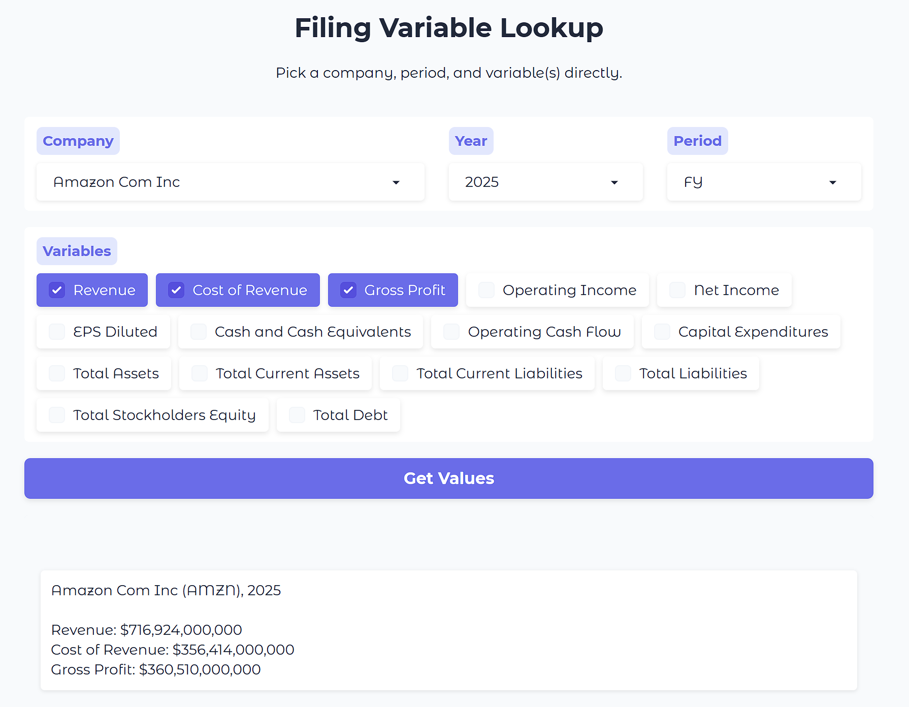
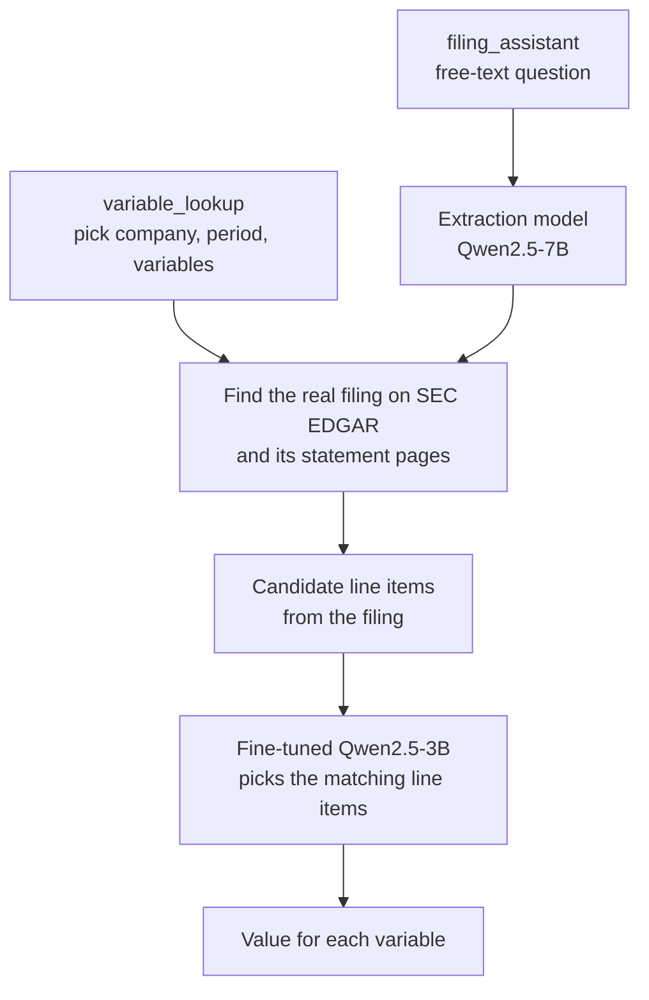

# LLM Financial Extraction


Extracts financial variables (revenue, net income, total assets and 12 more) from real SEC 10-K and 10-Q filings, using a fine-tuned Qwen2.5-3B model. Companies that file Form 20-F/6-K instead, mostly foreign private issuers, are excluded, since this pipeline only reads 10-K/10-Q filings.

## 🌐 Live demo

Try `variable_lookup/` online: [huggingface.co/spaces/Ofoski/filing-variable-lookup](https://huggingface.co/spaces/Ofoski/filing-variable-lookup). It runs on a shared GPU with a small daily limit per visitor, and may be taken offline at any time.



## ⚙️ How it works



### `variable_lookup/`

You pick a company, period, and variable(s) from dropdowns. The app looks up a real filing period from that company's own filing history, pulls the line items from the right statement of that filing, and a fine-tuned Qwen2.5-3B model (QLoRA, `qlora_adapter/`) picks which one (or combination, if a value has to be derived from multiple lines) represents each variable.

The company dropdown is a filtered, cached list of real domestic 10-K/10-Q filers.

### `filing_assistant/`

The same matching, driven by a free-text question like "What was Apple's revenue in Q1 2025?". A general-purpose model (Qwen2.5-7B-Instruct, no fine-tuning) first reads the question and pulls out the company name, period, and which of the 15 tracked variables you're asking about. The company name is resolved against SEC's real, full company list, then the matching step is the same as in `variable_lookup/`.

Example:
```
What was Amazon's revenue and net income in Q1 2026?

AMAZON COM INC (AMZN), Q1 2026

Revenue: $181,519,000,000
Net Income: $30,255,000,000
```

### `services/mcp_server/`

An MCP server that gives an AI agent such as Claude three tools for real SEC and market data. The tools return raw numbers, and the agent does the reasoning and any calculation itself, so no separately hosted model is involved.

| Tool | What it returns |
|---|---|
| `list_periods` | The fiscal years and quarters a company has actually filed with the SEC, each with its real period-end date. Fiscal quarters don't line up with calendar ones, so this comes first. |
| `get_report` | The real line items of an income statement, balance sheet, or cash flow statement, for one or more of those periods. |
| `get_stock_price` | The live price, or the closing price on a given date, adjusted for splits and dividends, for any listed ticker. |

The agent chains the tools to answer a question, for example:
- "What was Apple's revenue last quarter?" finds the latest period, then reads the income statement.
- "Compare Microsoft's and Google's operating cash flow" reads both cash flow statements and compares them.
- "What was Tesla's gross margin?" reads revenue and cost of revenue, then calculates the margin.
- "Compare the market cap of Apple and Amazon" combines each stock price with figures from the filings.

## 💻 Running locally

**What you need:** Python 3.10 or newer, and an NVIDIA GPU with CUDA for the two apps. Their models load with 4-bit quantization, which needs CUDA to run at a reasonable speed.

1. Clone the whole repo.
2. Open `xbrl_pipeline/edgar_helpers.py` and replace the placeholder `HEADERS` User-Agent with your own name and email. SEC asks every program that downloads from EDGAR to identify itself this way.
3. Install the requirements for the two apps once, from the repo root:
   ```bash
   python -m venv venv
   venv\Scripts\activate      # on Windows; source venv/bin/activate on macOS/Linux
   pip install -r requirements.txt
   ```
4. Run an app.

**Variable lookup (direct selection)**:
```bash
cd variable_lookup
python app.py
```
Runs on port 7863. `build_company_list.py` can be rerun to refresh the cached, filtered `companies_cache.json`.

**Filing assistant (chat)**:
```bash
cd filing_assistant
python app.py
```
Runs on port 7860.

**MCP server** (separate from the two apps, it has its own requirements):
```bash
# with Python
cd services/mcp_server
python -m venv venv
venv\Scripts\activate
pip install -r requirements.txt
python server.py

# with Docker (run from the repo root)
docker build -f services/mcp_server/Dockerfile -t mcp-server .
docker run -p 8000:8000 mcp-server
```
Runs on port 8000. With the server running, open a Claude Code session in this folder (`.mcp.json` already points to it) and run `/mcp` to check it's connected. The server window shows `200 OK` when Claude connects. Then ask a question like "what was AAPL's revenue last quarter?"

Claude decides on its own when to call the server, based on what you ask it. You never call it directly yourself.

## 📊 The 15 tracked variables

Collected from real 10-K (annual) and 10-Q (quarterly, Q1, Q2, Q3) SEC filings. The fine-tuned adapter was trained on 6,915 real, analyst-verified examples, validated during training on a further 759, and scores **92.4% exact-match accuracy** overall on a fully held-out test set of 1,440 examples across 48 companies (2 per sector, 24 sectors) never seen during training or validation:

| Variable | Accuracy |
|---|---|
| Total Current Assets | 100.0% |
| Total Current Liabilities | 100.0% |
| Cash and Cash Equivalents | 99.0% |
| Operating Cash Flow | 99.0% |
| Total Assets | 99.0% |
| Total Stockholders Equity | 99.0% |
| EPS Diluted | 94.8% |
| Revenue | 94.8% |
| Net Income | 92.7% |
| Cost of Revenue | 90.6% |
| Operating Income | 89.6% |
| Capital Expenditures | 87.5% |
| Gross Profit | 87.5% |
| Total Debt | 82.3% |
| Total Liabilities | 70.8% |

## ⚠️ Limitations

- Total Liabilities (70.8%) and Total Debt (82.3%) are the weakest variables. A wrong match looks the same as a right one, and a variable shows N/A when the model finds no matching line in the filing.
- Only 10-K and 10-Q filings from 2020 onward are supported. SEC has no standalone Q4 filing, since the 10-K covers that period.
- For Q2 and Q3, Operating Cash Flow and Capital Expenditures are cumulative (6 or 9 months), not just the quarter.
- Statement pages are found by keywords in their titles, so a filing with an unusual title may not be found.
- The live demo gives each visitor a small daily GPU allowance.

Improving these is the next step.

## 📁 Project structure

```
Financial-Analysis/
├── variable_lookup/                 # Direct-selection app (dropdowns)
│   ├── app.py                       # Gradio UI (company/period/variable dropdowns)
│   ├── build_company_list.py        # One-time build: filters SEC's full company list to real 10-K/10-Q filers
│   └── companies_cache.json         # That build script's cached output
│
├── filing_assistant/                # Free-text chat app
│   ├── app.py                       # Gradio UI
│   ├── extract.py                   # Reads the question, extracts company/period/variables (Qwen2.5-7B)
│   ├── qa_backend.py                # Runs extract -> resolve -> pipeline for one question
│   ├── resolver.py                  # Resolves a company name to a real ticker/CIK
│   └── pipeline.py                  # Fetches real filing data, runs the fine-tuned adapter, resolves the real value (also used by variable_lookup)
│
├── qlora_adapter/                   # The fine-tuned model filing_assistant/variable_lookup both use
│   ├── adapter/                     # The trained LoRA adapter weights (Qwen2.5-3B base)
│   └── prompt_format.py             # The exact prompt format the adapter was trained on
│
├── services/
│   └── mcp_server/                  # MCP server service
│       ├── server.py                # MCP tools (list_periods, get_report, get_stock_price)
│       ├── financial_data.py        # Business logic behind list_periods/get_report
│       ├── stock_price.py           # Real stock price lookups (via yfinance)
│       ├── Dockerfile
│       └── requirements.txt
│
├── xbrl_pipeline/                   # Shared by every piece above
│   ├── edgar_helpers.py             # SEC EDGAR ticker/CIK lookup
│   ├── xbrl_method.py               # Finds/parses real SEC filings and their XBRL data
│   ├── collect_annual_xbrl.py       # Collects candidate line items from a 10-K
│   ├── collect_quarterly_xbrl.py    # Collects candidate line items from a 10-Q
│   └── collect_statement_xbrl.py    # Shared engine behind the two collectors above
│
├── .dockerignore                    # services/mcp_server/Dockerfile builds from the repo root, this keeps that build small
├── .mcp.json                        # Connects Claude Code to the MCP server locally
├── requirements.txt                 # Requirements for variable_lookup and filing_assistant
└── README.md
```
